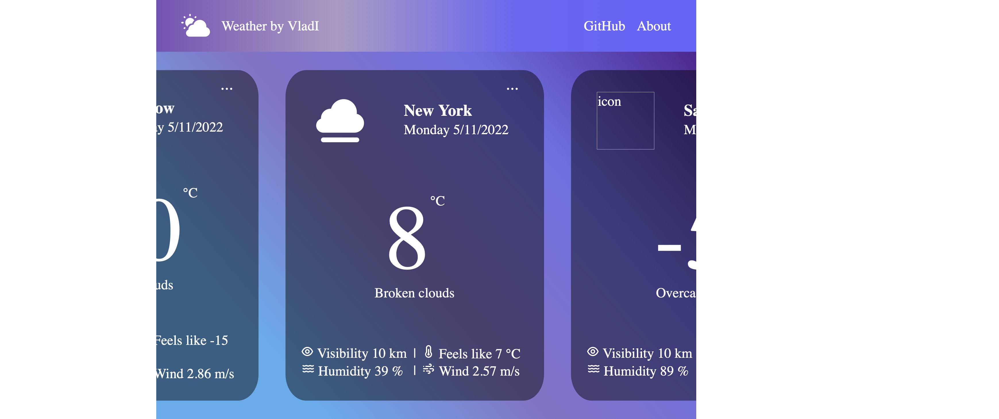

# CV
## Курсы

В 2021 году закончил школу "SpinIT" от Bonch.dev по направлению Front-end

 Выпускным проектом был онлайн магазин. Реализованы: страница товаров, страничка товара, корзина при помощи фреймворка Vue.

## Проекты

В ходе своего обучения регулярно создавал пет-проекты, в основном интернет магазины.
Все проекты предстваленные ниже реализованы на ReactJS и React - TypeScript.  

### Pizza

Один из таких проектов - сайт пиццерии. Проект реализован на ReactJS с использованием Redux. В качестве backend используется json-server.

Реализована возможноть сортировки путем отправки запроса на сервер с query параметрами,
адаптивная верстка и возможность добавления товаров в корзину. Также реализована постраничная
пагинация, по 8 карточек товаров на странице.

Была ещё одна версия этого проекта с реализацией своего backend сервера на node.js и базой данных Mongo.DB

### Weather Forecast
В качестве ещё одного пет-проекта было реализовано простое приложение прогноза погоды. Получение данных с [OpenWeather](https://openweathermap.org/api)

### MoviesFinder
Проект по поиску фильмов и сериалов.
Реализована главная страница с подборкой фильмов, страница выбранного фильма, страница поиска фильмов, данные: IMDB.

### BigBonch
Проект реализуемый на факультативе blockchain в вузе, находится в стадии разработки, мною реализуется большая часть фронтенда этого пректа.
Вся инофрмация о проекте: [Big Bonch GitHub](https://github.com/Redarek/big-bonch)
Также в корне репозитория находится видео демонстрирующее проект.

Из последних обновлений: была реализована функция всплывающего окна при наведении курсора на определенные координаты

### Корпортаивное приложение 

В данный момент занимаюсь разработкой корпоративного веб-приложения для отслеживания активности сотрудников.
